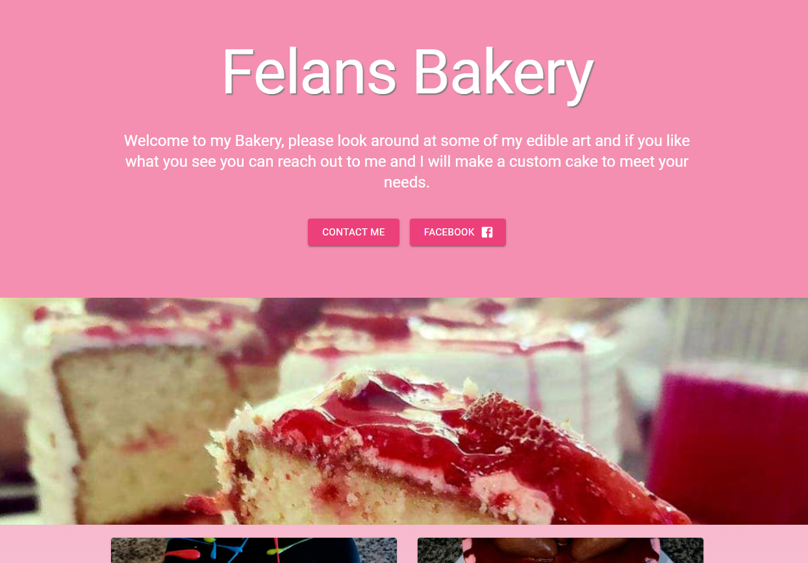
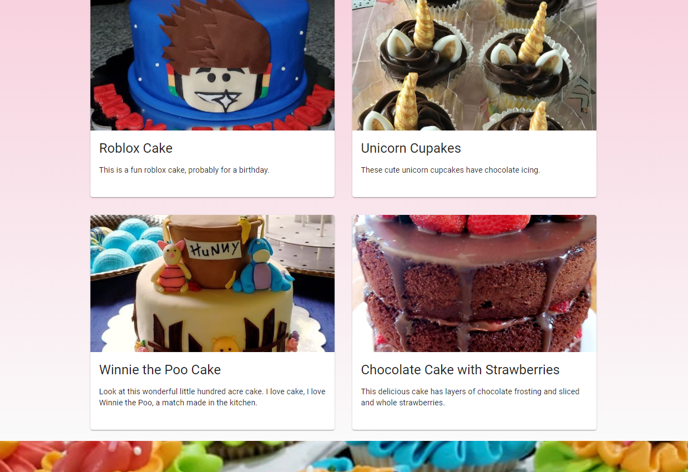

# Felan's Bakery

## Description

This is a front page site for a local custom cake and sweets bakery in North Austin/Pflugerville, Texas. This website is built using [React](https://reactjs.org/) and [Sanity.io](https://www.sanity.io/). The parallax scrolling effect above and below the main content section was created using the [react-parallax npm](https://www.npmjs.com/package/react-parallax). The form functionality is thanks to the [Formspree](https://formspree.io/f/xbjqovab) service. The website is hosted on [Netlify](https://www.netlify.com/) and is styled using Google's [Material UI](https://material-ui.com/) framework.

## Table of Contents

* [Link](#Link)

* [Screenshot](#Screenshot)

* [License](#license)

* [Questions](#questions)

## Link

[This link will take you to the deployed site on Netlify!](https://felansbakery.com/)

## Screenshot

## License

- MIT

- https://opensource.org/licenses/MIT

## Questions

If you have any questions about the app, open an issue or contact me through the contact form on my portfolio website: https://joeysiskportfolio.netlify.app/. You can find more of my work at [Joey Sisk](github.com/joey-sisk).
